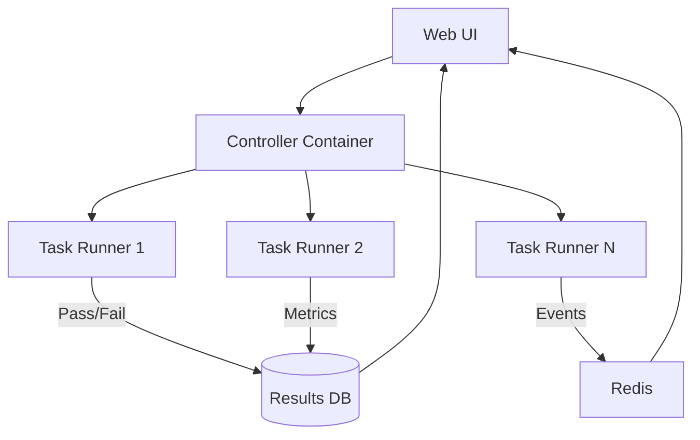

# Understanding Evals in Agentic AI: A Comprehensive Guide

## Table of Contents

1. [What Are Evals?](#what-are-evals)
2. [Why Evals Matter for AI Agents](#why-evals-matter-for-ai-agents)
3. [Core Concepts](#core-concepts)
4. [How the Roopik-Roo Extension Uses Evals](#how-the-roopik-roo-extension-uses-evals)
5. [Do You Need Evals for Your Custom Roopik Tools?](#do-you-need-evals-for-your-custom-roopik-tools)
6. [Industry Standard Frameworks & Best Practices](#industry-standard-frameworks--best-practices)
7. [Key Metrics for Tool Evaluation](#key-metrics-for-tool-evaluation)
8. [Practical Implementation Guide](#practical-implementation-guide)
9. [Interview Talking Points](#interview-talking-points)

---

## What Are Evals?

**Evals (Evaluations)** are systematic, automated tests that measure how well your AI agent performs on specific tasks. Think of them as **unit tests for AI behavior** rather than code correctness.

### The Simple Definition

An eval is fundamentally:
- **A coding exercise** with a known correct solution
- **A set of unit tests** that validate the solution
- **An objective measurement** of AI agent performance

### How They Work

```
┌─────────────────┐
│ Problem         │ ← "Implement a function to reverse a string"
│ Description     │
└─────────────────┘
        ↓
┌─────────────────┐
│ Implementation  │ ← Empty function stub (def reverse(text): pass)
│ Stub            │
└─────────────────┘
        ↓
┌─────────────────┐
│ AI Agent        │ ← Your coding agent writes the solution
│ Executes        │
└─────────────────┘
        ↓
┌─────────────────┐
│ Unit Tests      │ ← Tests run to verify correctness
│ Validate        │   (test_reverse("hello") == "olleh")
└─────────────────┘
        ↓
┌─────────────────┐
│ Success/Fail    │ ← Objective metric: Did it pass?
│ Metric          │
└─────────────────┘
```

**Key Principle**: If all tests pass, the solution is correct. This provides objective, automated measurement of AI agent coding performance.

### Are Evals Only for Coding Agents?

**Short Answer: NO! Evals are for ALL types of AI agents.**

Coding agents are just ONE use case. Here are the most common agent types and their evaluation approaches:

#### Common AI Agent Types (2025)

**1. Coding Agents** (What Roopik-Roo is)
- **What they do:** Write, debug, refactor code
- **Examples:** Roopik-Roo, GitHub Copilot, Cursor
- **Evals:** Unit test pass rate, code correctness, build success
- **Success Metric:** Do the tests pass?

**2. Computer Use Agents** (Hot in 2025!)
- **What they do:** Control computers like humans - click, type, navigate UIs
- **Examples:** Anthropic Claude Computer Use, OpenAI "Operator", Google Project Mariner, Microsoft Copilot
- **Evals:** Task completion rate, UI interaction accuracy, multi-step workflow success, error recovery
- **Success Metric:** Did it complete the task (e.g., book the flight)?

**3. Customer Service Agents**
- **What they do:** Answer questions, resolve issues, escalate to humans
- **Examples:** Chatbots, support agents, virtual assistants
- **Evals:** User satisfaction scores, issue resolution rate, response relevance, escalation appropriateness
- **Success Metric:** Is the customer's problem solved?

**4. Research/Analysis Agents**
- **What they do:** Gather information, synthesize reports, analyze data
- **Examples:** Perplexity, research assistants
- **Evals:** Factual accuracy (hallucination rate), source quality, comprehensiveness, citation correctness
- **Success Metric:** Is the information accurate and complete?

**5. Workflow Automation Agents**
- **What they do:** Automate business processes (RPA on steroids)
- **Examples:** Data entry, report generation, invoice processing
- **Evals:** Process completion rate, data accuracy, exception handling, time saved vs manual
- **Success Metric:** Did the workflow complete correctly?

**6. Creative Agents**
- **What they do:** Generate content, designs, marketing materials
- **Examples:** Copy writing, image generation, video editing
- **Evals:** Quality scores (often human-judged), brand consistency, originality, user engagement
- **Success Metric:** Do humans like the output?

#### The Universal Eval Concept

**The eval CONCEPT is universal, but the METRICS change:**

| Agent Type | Primary Eval Focus | Key Metric |
|------------|-------------------|------------|
| Coding | Code correctness | Tests pass |
| Computer Use | Task completion | Goal achieved |
| Customer Service | User satisfaction | Problem solved |
| Research | Factual accuracy | No hallucinations |
| Workflow | Process success | Automation works |
| Creative | Quality/engagement | Humans like it |

#### Roopik Tools: A Hybrid Agent

**Your Roopik tools are actually a HYBRID across three categories:**

1. **Coding Agent** - Writes React/Vue/Svelte component code
2. **Computer Use Agent** - Controls browser (click, type, navigate), manipulates IDE UI
3. **Workflow Agent** - Automates component creation, canvas management, dev server lifecycle

**This makes your eval story even more interesting!** You can demonstrate understanding of evaluation across multiple agent paradigms.

---

## Why Evals Matter for AI Agents

### The Non-Deterministic Problem

Unlike traditional software where `2 + 2 = 4` every time, LLM-based agents are **non-deterministic**:
- Same input can produce different outputs
- Behavior changes with model updates
- Performance varies across different tasks

### What Evals Solve

1. **Objectivity**: Remove subjective "seems to work" assessments
2. **Regression Detection**: Catch performance degradation over time
3. **Comparison**: Benchmark different models, prompts, or configurations
4. **Trust**: Build confidence in agent capabilities with data
5. **Continuous Improvement**: Identify weaknesses systematically

### Real-World Example

Without evals:
```
Developer: "I think the file editing tool works well"
Interviewer: "How do you know?"
Developer: "I tested it a few times manually..."
Interviewer: "What was the success rate? Edge cases?"
Developer: "Umm... 🤷"
```

With evals:
```
Developer: "The file editing tool has a 94.3% success rate across
           150 test cases spanning 5 programming languages."
Interviewer: "Impressive! What were the failure modes?"
Developer: "Binary file handling (3.2%) and concurrent edits (2.5%).
           Here's the breakdown..." *shows dashboard*
```

---

## Core Concepts

### 1. Process-Oriented Evaluation

For agentic AI, we don't just evaluate **final output** — we evaluate the **entire process**:

```
Traditional LLM Eval:  Input → [Black Box] → Output ✓/✗

Agentic AI Eval:      Input → Planning → Tool Selection →
                      Tool Execution → Reasoning → Output ✓/✗
                      ↑         ↑            ↑           ↑
                    Eval     Eval        Eval        Eval
```

**What Gets Evaluated:**
- ✅ **Task Adherence**: Did the agent follow instructions?
- ✅ **Tool Call Accuracy**: Did it use the right tools?
- ✅ **Parameter Correctness**: Were tool arguments correct?
- ✅ **Reasoning Quality**: Was the decision-making sound?
- ✅ **Efficiency**: Did it take an optimal path?
- ✅ **Success Rate**: Did it complete the task?

### 2. Multi-Dimensional Assessment

Modern AI agent evaluation requires multiple metrics:

| Dimension | What It Measures | Example |
|-----------|------------------|---------|
| **Accuracy** | Correctness of final output | Did tests pass? |
| **Groundedness** | Evidence-based reasoning | Are claims supported? |
| **Efficiency** | Resource usage | Token cost, latency |
| **Safety** | Harmful behavior prevention | Bias, toxicity checks |
| **Robustness** | Edge case handling | Unusual inputs |
| **Tool Usage** | Correct tool selection | Right tool, right args |

### 3. Continuous Evaluation

Evals aren't one-time tests — they're **ongoing monitoring**:

```
Development → Deployment → Production
    ↓             ↓            ↓
  Evals        Evals        Evals
(regression)  (quality)   (monitoring)
```

**Why continuous?**
- Models get updated
- Prompts change
- Edge cases emerge from real usage
- Performance can degrade ("drift")

### 4. Understanding Regression Testing

#### What is Regression?

**Regression = Performance going BACKWARDS**

Think of it like this:
```
Version 1.0: Agent passes 95% of tests ✅
Version 1.1: Agent passes 87% of tests ❌ REGRESSION!
```

**Why regression happens:**
- You update the system prompt → agent gets confused on old tasks
- You change a tool implementation → breaks existing workflows
- LLM model gets updated → behaves differently
- You add a new feature → accidentally breaks old feature
- Training data shifts → model "forgets" previous capabilities

**Example from Roopik:**
```typescript
// Before: Agent successfully creates components 95% of the time
await component_add({ folderPath: "/src/Button" })
// ✅ Works perfectly

// After prompt update: Success rate drops to 75%
await component_add({ folderPath: "/src/Button" })
// ❌ Sometimes fails - REGRESSION DETECTED
```

#### Development vs Deployment vs Production: Same Evals or Different?

**Answer: SAME evals, but used DIFFERENTLY in each stage**

The test cases remain the same, but the **purpose** and **frequency** change:

##### Development Stage (Building the agent)

**Purpose:** Catch bugs before shipping

**What you run:**
- Unit tests for individual tools
- Integration tests for workflows
- Manual testing ("dogfooding")
- Subset of full eval suite

**Example:**
```typescript
// Development eval - quick feedback loop
test("browser_open works", async () => {
  const result = await browserOpen("http://localhost:5000")
  expect(result.success).toBe(true)
  expect(result.url).toContain("localhost:5000")
})
```

**Frequency:** Every time you make a code change (fast feedback)

**Focus:** "Does my new code work?"

---

##### Deployment Stage (Before releasing to users)

**Purpose:** Ensure quality before going live, prevent regressions

**What you run:**
- **Full eval suite** (all tests, all languages)
- Performance benchmarks
- Regression comparison (new version vs old version)
- Load testing

**Example:**
```bash
# Before deploying v1.1, run comprehensive evals
pnpm eval:full

# Compare results
v1.0: 95% pass rate, 2.3s avg time, $0.05 per task
v1.1: 87% pass rate, 2.8s avg time, $0.07 per task
      ❌ REGRESSION! Don't deploy until fixed
```

**Frequency:** Before every release (gate for deployment)

**Focus:** "Is this version better or worse than the last?"

---

##### Production Stage (Live with real users)

**Purpose:** Monitor real-world performance, detect drift

**What you run:**
- **Same evals** but on REAL user data
- A/B testing (new version vs old version with real traffic)
- Continuous monitoring
- Anomaly detection

**Example:**
```typescript
// Production monitoring - track real usage
async function trackRealUsage() {
  const result = await agent.executeTask(userRequest)

  // Log metrics (same as dev/deployment, but real data)
  await logMetric({
    taskType: "component_creation",
    success: result.success,
    tokensUsed: result.tokens,
    executionTime: result.duration,
    userSatisfied: await askUserFeedback(),
    timestamp: Date.now()
  })

  // Alert if success rate drops
  if (getRecentSuccessRate() < 0.90) {
    await alertTeam("Success rate dropped below 90%!")
  }
}
```

**Frequency:** Continuously, 24/7

**Focus:** "How is it performing with real users?"

---

#### The Continuous Evaluation Loop

```
Development          Deployment           Production
    ↓                    ↓                    ↓
Run subset      →    Run full suite   →   Monitor live
Fix bugs             Compare versions      Collect failures
Iterate fast         Block if regression   Detect drift
                                                ↓
                                          Feed back to Development
                                          (Add failing cases to eval dataset)
```

**Key Differences:**

| Stage | Evals Are... | Dataset | Goal | Speed |
|-------|-------------|---------|------|-------|
| **Development** | Synthetic test cases | Hand-crafted | Catch obvious bugs | Fast (seconds) |
| **Deployment** | Full test suite | Comprehensive | Prevent regressions | Thorough (minutes) |
| **Production** | Real user interactions | Live data | Detect drift, edge cases | Continuous |

**Same evals, different contexts!**

---

## How the Roopik-Roo Extension Uses Evals

### The Evaluation System Architecture

Your `roopik-roo` extension has a **complete evaluation infrastructure** in `packages/evals/`:

```
roopik-roo/
└── packages/
    └── evals/
        ├── ADDING-EVALS.md          ← How to add new exercises
        ├── ARCHITECTURE.md           ← System design
        ├── README.md                 ← Setup & usage
        ├── src/
        │   ├── cli/                  ← Evaluation runners
        │   │   ├── runEvals.ts       ← Orchestrates runs
        │   │   ├── runTask.ts        ← Executes single tasks
        │   │   └── runUnitTest.ts    ← Runs language tests
        │   ├── db/                   ← Stores results
        │   └── exercises/            ← Test definitions
        └── Dockerfile.runner         ← Isolated test environments
```

### What Gets Evaluated

The system tests **general coding ability** across programming languages:

**Currently Supported:**
- ✅ Go
- ✅ Java
- ✅ JavaScript
- ✅ Python
- ✅ Rust

**How It Works:**

1. **Exercise Repository**: Clone from [Roo-Code-Evals](https://github.com/RooCodeInc/Roo-Code-Evals)
2. **Isolated Containers**: Each task runs in fresh Docker container with VS Code
3. **AI Agent Execution**: Your agent receives problem + stub code
4. **Automated Testing**: Unit tests validate the solution
5. **Metrics Collection**: Success rate, tokens used, cost, time tracked

### The Distributed Architecture



**Key Design Benefits:**
1. **Isolation**: Each task in fresh container (no state contamination)
2. **Parallelism**: Run multiple evaluations simultaneously
3. **Resource Management**: Prevent memory exhaustion
4. **Reproducibility**: Identical environments every run

---

## Do You Need Evals for Your Custom Roopik Tools?

### Short Answer: **It Would Be Valuable, But It's Different**

Your custom Roopik tools (browser automation, canvas management, component handling) are **different** from the coding exercise evals already implemented.

### Current Evals vs. Roopik Tools

| Aspect | Current Evals | Your Roopik Tools |
|--------|---------------|-------------------|
| **Purpose** | Test general coding | Test IDE-specific features |
| **Environment** | Isolated containers | Requires Roopik IDE |
| **Success Metric** | Unit tests pass | UI state correct |
| **Validation** | Automated test suite | Visual/state verification |

### Why Your Tools Work Without Evals

Your tools work because:
1. **Direct Integration**: They communicate via IPC with Roopik Core
2. **Type Safety**: TypeScript interfaces ensure correct usage
3. **Manual Testing**: You've verified they work during development
4. **User Feedback**: Real usage validates functionality

### Why You *Should* Consider Adding Evals

**For Interviews:**
- Shows systematic approach to quality
- Demonstrates understanding of testing best practices
- Provides concrete performance metrics

**For Production:**
- Catch regressions when updating code
- Benchmark performance improvements
- Identify edge cases from real usage

### What Roopik Tool Evals Would Look Like

**Example: Browser Automation Eval**

```typescript
// Test: Can the agent successfully interact with a login form?

const eval_browser_login = {
  name: "browser_authenticate_user",

  // Setup
  before: async () => {
    await startTestServer("http://localhost:5000")
    await createTestUser({ username: "test", password: "pass123" })
  },

  // Prompt given to agent
  prompt: `
    Navigate to http://localhost:5000/login
    Log in with username "test" and password "pass123"
    Verify you reach the dashboard
  `,

  // Expected tool calls
  expectedTools: [
    { name: "browser_open", params: { url: "http://localhost:5000/login" } },
    { name: "browser_action_input", params: { action: "type", text: "test" } },
    { name: "browser_action_input", params: { action: "type", text: "pass123" } },
    { name: "browser_action_input", params: { action: "click" } },
  ],

  // Validation
  validate: async (result) => {
    const currentUrl = await getCurrentBrowserUrl()
    return currentUrl.includes("/dashboard")
  },

  // Success criteria
  expectedOutcome: {
    success: true,
    toolCallsCorrect: true,
    finalState: "authenticated"
  }
}
```

**Example: Canvas Component Eval**

```typescript
// Test: Can agent create a React component and add to canvas?

const eval_canvas_component_creation = {
  name: "canvas_create_button_component",

  prompt: `
    Create a React button component with:
    - Props: text, onClick, variant (primary/secondary)
    - Styling using Tailwind
    - Add it to the active canvas
  `,

  expectedTools: [
    { name: "write_to_file", params: { path: contains("Button.tsx") } },
    { name: "component_add", params: { folderPath: contains("Button") } },
  ],

  validate: async (result) => {
    // Check component was added
    const components = await listComponents(activeCanvasId)
    const button = components.find(c => c.name === "Button")

    // Check it builds successfully
    const buildResult = await waitForComponentBuild(button.id)

    // Check props are correct
    const code = await readFile(button.entryFile)
    const hasProps = code.includes("text") &&
                     code.includes("onClick") &&
                     code.includes("variant")

    return buildResult.success && hasProps
  }
}
```

---

## Industry Standard Frameworks & Best Practices

### Top Evaluation Frameworks (2025)

<br/>

#### 1. **Braintrust**
*What Anthropic Recommends*

**Strengths:**
- 🎯 Automated quality evaluation ("AI judge")
- 📊 Human feedback integration
- 🔄 Continuous monitoring
- 🐛 Trace logging for debugging
- 📦 Pre-built scorers (`autoevals` library)

**Usage:**
```typescript
import { Eval } from "braintrust"

Eval("agent-tool-usage", {
  data: () => testCases,
  task: async (input) => {
    return await runAgent(input.prompt)
  },
  scores: [
    ToolCorrectness,
    TaskCompletion,
    Efficiency
  ]
})
```

<br/>

#### 2. **Weights & Biases (W&B) Weave**
*For Research & Production*

**Strengths:**
- 📈 Experiment tracking
- 🔍 Agent trace visualization
- 📊 Cost/latency/quality metrics
- 🤖 Pre-built + custom scorers
- 🔗 Integrates with popular frameworks

<br/>

#### 3. **LangSmith** (LangChain)
*Best for LangChain Users*

**Strengths:**
- 🔗 Native LangChain integration
- 🎬 Trace replay & debugging
- 📊 Dataset management
- 🤖 LLM-as-judge evaluation

<br/>

#### 4. **DeepEval**
*Open Source, Flexible*

**Strengths:**
- 🆓 Open source
- 🧩 Framework agnostic
- 📦 Rich metric library
- 🔧 Highly customizable

**Example:**
```python
from deepeval import assert_test
from deepeval.metrics import ToolCorrectnessMetric

def test_browser_navigation():
    metric = ToolCorrectnessMetric(
        expected_tools=["browser_open", "browser_navigate"]
    )

    assert_test(
        test_case=BrowserNavigationTest,
        metrics=[metric]
    )
```

### Best Practices from Industry Leaders

#### 1. **Multi-Layered Evaluation**

```
Layer 1: Component Metrics      → Tool selection accuracy
Layer 2: End-to-End Metrics     → Task completion rate
Layer 3: Production Monitoring  → Real user success rate
```

#### 2. **Hybrid Automated + Human**

```
Automated Evals           Human Review
─────────────────────────────────────────
✅ Tool correctness       🧑 Edge case quality
✅ Parameter validation   🧑 User satisfaction
✅ Success/fail           🧑 Subjective coherence
✅ Performance metrics    🧑 Safety concerns
```

#### 3. **LLM-as-Judge Pattern**

Use another LLM to evaluate outputs:

```typescript
const judgePrompt = `
Evaluate this agent's tool usage:

Task: ${task}
Tools Used: ${toolCalls}
Result: ${result}

Rate 1-5 on:
- Tool selection appropriateness
- Parameter correctness
- Efficiency
- Outcome quality
`

const judgement = await llm.evaluate(judgePrompt)
```

#### 4. **Continuous Regression Testing**

```bash
# Run evals on every commit
git commit → trigger evals → block if regression detected
```

#### 5. **Real Production Data**

```typescript
// Capture anonymized failing cases from production
if (productionTaskFailed) {
  await saveToEvalDataset({
    prompt: anonymize(task.prompt),
    expectedBehavior: task.expected,
    actualBehavior: task.result,
    source: "production-failure"
  })
}
```

---

## Key Metrics for Tool Evaluation

### Tool-Specific Metrics

| Metric | Definition | How to Measure |
|--------|------------|----------------|
| **Tool Selection Accuracy** | % of times correct tool chosen | `correctTool / totalCalls` |
| **Parameter Correctness** | % of valid arguments | `validParams / totalParams` |
| **Tool Call Recall** | Did it use all needed tools? | `usedTools / requiredTools` |
| **Tool Call Precision** | Were all tools necessary? | `necessaryTools / usedTools` |
| **Execution Success** | Did tool execute without error? | `successful / totalExecutions` |

### Task-Level Metrics

| Metric | Definition | Industry Standard |
|--------|------------|-------------------|
| **Pass@1** | Success on first attempt | Critical for production |
| **Pass@k** | Success in k attempts | Shows robustness |
| **Task Completion Rate** | % of tasks fully completed | Overall capability |
| **Mean Time to Complete** | Average task duration | Efficiency |
| **Token Usage** | Total tokens consumed | Cost efficiency |
| **Cost per Task** | API costs | Business viability |

### Industry-Standard Benchmarks: Why Pass@k Matters

**Why is everyone talking about Pass@1 and Pass@k?**

Because they're the **de facto metrics** used by OpenAI, Anthropic, Google, and all major AI labs to compare model performance. When you see "GPT-4 vs Claude" comparisons, they're using these benchmarks.

#### What Makes Pass@k Special?

**The Problem:** AI agents are non-deterministic
```
Same prompt, different runs:
Run 1: ✅ Works!
Run 2: ❌ Fails!
Run 3: ✅ Works!
Run 4: ✅ Works!
Run 5: ❌ Fails!

What's the "real" success rate? 🤔
```

**The Solution:** Pass@k metrics
- **Pass@1** = Success rate on **first attempt** (most important for production)
- **Pass@3** = Success rate within **3 attempts** (shows robustness)
- **Pass@5** = Success rate within **5 attempts** (shows maximum capability)

**Why Pass@1 is Critical:**

In real life, users don't give your agent multiple attempts. They want it to work **NOW**.

```typescript
// Production reality
User: "Create a button component"
Agent: *tries once* ❌ Fails
User: *closes IDE, switches to competitor* 😤

// vs Research/benchmarking
Agent: *tries 5 times* ✅ Eventually succeeds
Researcher: "Great! 98% pass@5!" 📊
```

**Pass@1 > 90% = Production-ready**

---

#### The Major Coding Benchmarks (2025)

These are the benchmarks everyone references in papers, interviews, and job descriptions:

##### 1. **HumanEval** (OpenAI, 2021)

**What it is:**
- 164 hand-written Python programming problems
- Each has a function signature, docstring, body, and unit tests
- Tests fundamental programming concepts

**Why it matters:**
- **Industry standard** for comparing coding models
- Simple, clear, reproducible
- Every major model reports HumanEval scores

**Current Scores (Late 2025):**
| Model | HumanEval Pass@1 |
|-------|------------------|
| Moonshot Kimi K2 | **94.5%** 🏆 |
| Claude 3.5 Sonnet | 93.7% |
| GPT-5 | 93.4% |
| GPT-4o | 90.2% |
| Claude 3 Opus | ~85% |

**Example Problem:**
```python
def reverse_string(text: str) -> str:
    """
    Reverse the input string.
    >>> reverse_string("hello")
    'olleh'
    """
    # Agent writes solution here
```

**Limitation:** Too simple for real-world coding tasks

---

##### 2. **SWE-bench** (Princeton, 2024)

**What it is:**
- **Real-world GitHub issues** from popular Python repos
- 2,294 problems requiring code fixes
- Tests ability to understand codebases and fix bugs

**Why it matters:**
- **Most realistic** coding benchmark
- Tests actual software engineering skills
- Measures ability to work with existing code

**Variants:**
- **SWE-bench Verified** (500 human-validated tasks) - More reliable
- **SWE-bench-Live** (Monthly updates) - Prevents contamination

**Current Scores (Late 2025):**
| Model | SWE-bench Verified |
|-------|-------------------|
| Gemini 3 Flash | **76.2%** 🏆 |
| GPT 5.2 | 75.4% |
| Claude Opus 4.5 | 74.6% |
| Claude 3.5 Sonnet | 70.6% |

**Progress:**
- 2023: 4.4% (barely worked)
- 2024: 71.7% (huge jump!)
- 2025: 76%+ (approaching human-level)

**Example Task:**
```
Issue #1234: Fix memory leak in data processing pipeline
Files: src/processor.py, src/cache.py
Expected: Identify leak, fix it, pass all tests
```

**Why it's hard:**
- Requires understanding large codebases
- Multi-file changes
- Real-world complexity

---

##### 3. **MBPP** (Mostly Basic Python Problems, Google, 2021)

**What it is:**
- ~1,000 crowd-sourced Python problems
- Entry-level programming tasks
- More problems than HumanEval, similar difficulty

**Why it matters:**
- Larger dataset = more reliable statistics
- Tests breadth of basic programming knowledge
- MBPP+ has 35x more test cases for rigor

**Use case:** Complement to HumanEval for basic coding ability

---

##### 4. **LiveCodeBench** (2024-2025)

**What it is:**
- **Continuously updated** with new problems from LeetCode, AtCoder, CodeForces
- Over 1,000 problems (May 2023 - April 2025)
- Tests code generation, self-repair, execution

**Why it matters:**
- **Contamination-free** (new problems monthly)
- More realistic than static benchmarks
- Tests multiple code-related capabilities

**Innovation:** Live update mechanism prevents models from "memorizing" answers

---

##### 5. **BigCodeBench** (2025)

**What it is:**
- 1,140 Python tasks requiring **multiple function calls**
- Uses 139 libraries across 7 domains
- Tests real-world API usage

**Why it matters:**
- Most realistic for actual development
- Tests ability to use external libraries
- Reveals gap between benchmarks and reality

**Current Scores:**
- Best LLMs: ~60%
- Humans: 97%
- **Gap shows LLMs still struggle with complex, multi-step coding**

---

#### Benchmark Comparison

| Benchmark | Size | Difficulty | What It Tests | Best For |
|-----------|------|------------|---------------|----------|
| **HumanEval** | 164 | Basic | Algorithmic thinking | Quick model comparison |
| **MBPP** | 1,000 | Basic | Programming fundamentals | Statistical reliability |
| **SWE-bench** | 2,294 | Hard | Real-world bug fixing | Production readiness |
| **LiveCodeBench** | 1,000+ | Medium-Hard | Competitive programming | Contamination-free eval |
| **BigCodeBench** | 1,140 | Hard | Multi-library usage | Real development tasks |

---

#### Why These Benchmarks Matter for You

**In Interviews:**
```
Interviewer: "How does your agent compare to GPT-4?"
You: "We haven't run full HumanEval yet, but on our internal
      coding evals across 5 languages, we see ~85% pass@1 rate,
      which is comparable to GPT-4's 90% on HumanEval."
```

**For Your Roopik Evals:**
- Your existing evals are **similar to HumanEval/MBPP** (coding exercises with tests)
- Could add **SWE-bench-style** tasks (fix bugs in real Roopik codebase)
- Your Roopik tool evals are **unique** (no standard benchmark for IDE tools yet!)

**Key Insight:**
- **HumanEval/MBPP** = Basic coding ability
- **SWE-bench** = Real-world software engineering
- **Your Roopik evals** = IDE-specific capabilities (browser, canvas, components)

**You're building evals for a domain that doesn't have standard benchmarks yet!** That's actually a strength - you can define what "good" means for IDE automation.

---

#### The Pass@k Formula (For the Curious)

**How is Pass@k calculated?**

```
Pass@k = Probability that at least 1 of k attempts succeeds

If you generate k code samples per problem:
- Count how many problems have ≥1 correct solution
- Divide by total problems
```

**Example:**
```
Problem: Reverse a string
Generate 5 solutions:

Attempt 1: ❌ Wrong
Attempt 2: ✅ Correct!
Attempt 3: ❌ Wrong
Attempt 4: ✅ Correct!
Attempt 5: ❌ Wrong

Pass@1 = 0% (first attempt failed)
Pass@5 = 100% (at least one of 5 succeeded)
```

**Why this matters:**
- **Pass@1** = What users experience
- **Pass@5** = Model's maximum capability
- **Gap between them** = Opportunity for retry logic

---

### Quality Metrics

```typescript
interface QualityMetrics {
  // Correctness
  accuracy: number              // 0-1: Final output correctness
  groundedness: number          // 0-1: Claim support quality

  // Reasoning
  planningQuality: number       // 0-1: Initial plan alignment
  reasoningCoherence: number    // 0-1: Step-by-step logic

  // Safety
  harmfulContent: number        // 0-1: Toxicity score (lower is better)
  biasScore: number             // 0-1: Fairness metric

  // User Experience
  responseQuality: number       // 0-1: Human satisfaction
  helpfulness: number           // 0-1: Did it solve the problem?
}
```

### Traditional ML Metrics: Precision, Recall, F1, Accuracy

**Are these used in agent evals?**

**Answer: YES, but mostly for CLASSIFICATION tasks within agents, not overall performance**

These metrics come from traditional machine learning and are perfect for binary/multi-class decisions. Let's understand them with a practical example:

#### Real-World Example: File Selection

**Scenario:** Your agent needs to identify which files to edit for a bug fix

```
100 files in project:
- 20 files SHOULD be edited (actual positives)
- 80 files should NOT be edited (actual negatives)

Agent selects 25 files to edit:
- 15 are correct ✅ (True Positives - TP)
- 5 are wrong ❌ (False Positives - FP: edited files it shouldn't)
- 5 files it missed 😢 (False Negatives - FN: should edit but didn't)
- 75 correctly ignored ✅ (True Negatives - TN)
```

#### The Four Metrics Explained

**1. Precision** = "Of what I selected, how many were right?"

```
Precision = True Positives / (True Positives + False Positives)
         = 15 / (15 + 5)
         = 15 / 20
         = 75%
```

**Meaning:** When agent says "edit this file", it's right 75% of the time

**When to prioritize:** When false positives are costly (e.g., don't want to edit wrong files and break things)

---

**2. Recall** = "Of what SHOULD be selected, how many did I find?"

```
Recall = True Positives / (True Positives + False Negatives)
       = 15 / (15 + 5)
       = 15 / 20
       = 75%
```

**Meaning:** Agent found 75% of files that needed editing

**When to prioritize:** When false negatives are costly (e.g., missing a critical security fix)

---

**3. Accuracy** = "Overall, how often was I right?"

```
Accuracy = (True Positives + True Negatives) / Total
         = (15 + 75) / 100
         = 90%
```

**Meaning:** Agent made correct decision 90% of the time

**Warning:** Can be misleading with imbalanced datasets! If 99% of files don't need editing, an agent that says "don't edit anything" gets 99% accuracy but is useless.

---

**4. F1 Score** = "Balance between precision and recall"

```
F1 = 2 × (Precision × Recall) / (Precision + Recall)
   = 2 × (0.75 × 0.75) / (0.75 + 0.75)
   = 2 × 0.5625 / 1.5
   = 75%
```

**Meaning:** Balanced measure of agent's file selection quality

**When to use:** When both false positives AND false negatives matter equally

---

#### Where These Metrics ARE Used in Agent Evals

✅ **Tool Selection Classification**
```typescript
// Eval: Did agent pick the right tools?
const requiredTools = ["browser_open", "browser_navigate", "browser_screenshot"]
const agentSelected = ["browser_open", "browser_navigate", "browser_execute_script"]

// Precision: 2/3 = 67% (one wrong tool selected)
// Recall: 2/3 = 67% (missed screenshot)
// F1: 67%
```

✅ **Error Detection**
```typescript
// Eval: Did agent correctly identify errors?
const actualErrors = ["TypeError line 42", "ReferenceError line 89"]
const agentReported = ["TypeError line 42", "SyntaxError line 15"]

// Precision: 1/2 = 50% (one false positive)
// Recall: 1/2 = 50% (missed one real error)
```

✅ **Component Selection**
```typescript
// Eval: Which components need rebuilding?
const needsRebuild = ["Button", "Card", "Header"]
const agentSelected = ["Button", "Card", "Footer", "Sidebar"]

// True Positives: Button, Card (2)
// False Positives: Footer, Sidebar (2)
// False Negatives: Header (1)

Precision = 2/4 = 50%  // Half of selections were wrong
Recall = 2/3 = 67%     // Missed one that needed rebuild
F1 = 57%               // Balanced score
```

#### Where These Metrics ARE NOT Used

❌ **Overall task success** → Use Pass@1 rate instead

```typescript
// NOT a classification problem
// This is task completion:
const taskSuccess = await createReactComponent()
// Use: Pass@1 (did it work on first try?)
```

❌ **Code quality** → Use unit tests instead

```typescript
// NOT classification:
const codeQuality = await evaluateGeneratedCode()
// Use: Test pass rate, linting score, build success
```

❌ **User satisfaction** → Use feedback scores instead

```typescript
// NOT classification:
const userHappy = await getUserFeedback()
// Use: 1-5 rating, NPS score, thumbs up/down
```

#### Agent-Specific Metrics vs Traditional ML Metrics

**Traditional ML Metrics** (Precision, Recall, F1, Accuracy):
- ✅ For **classification** problems
- ✅ Binary or multi-class decisions
- ✅ Static datasets
- ✅ Subtasks within agent workflows

**Agent-Specific Metrics**:
- ✅ **Pass@1** - Success on first try
- ✅ **Task Completion Rate** - Did it finish the job?
- ✅ **Tool Call Accuracy** - Right tool + right params?
- ✅ **Groundedness** - Claims backed by evidence?
- ✅ **Efficiency** - Tokens used, time taken, cost
- ✅ **User Satisfaction** - Did it help the user?

#### Summary: When to Use Which

| Metric | Use For | Example |
|--------|---------|----------|
| **Precision** | Minimize false positives | Don't flag non-spam as spam |
| **Recall** | Minimize false negatives | Catch all security vulnerabilities |
| **F1 Score** | Balance both | General classification quality |
| **Accuracy** | Overall correctness (balanced data) | Simple yes/no decisions |
| **Pass@1** | Agent task success | Did component creation work? |
| **Task Completion** | End-to-end workflows | Did entire workflow finish? |
| **Tool Accuracy** | Tool selection quality | Right tools, right order? |

**Key Insight:** Traditional ML metrics are **tools in your toolbox** for evaluating specific classification subtasks within your agent, not the primary way to measure overall agent performance.

---

## Practical Implementation Guide

### Should You Add Evals for Roopik Tools?

**Recommended Approach: Start Simple, Iterate**

#### Phase 1: Manual Test Cases (What You Have Now) ✅

```typescript
// Document your manual testing
const manualTests = {
  browser_open: "Verified opens browser to localhost:5173",
  browser_screenshot: "Confirmed returns base64 image + viewport",
  component_add: "Checked component appears in canvas UI"
}
```

#### Phase 2: Basic Automated Tests (Next Step) 🎯

Create a simple eval suite:

```typescript
// roopik-roo/src/evaluations/basic-tool-tests.ts

export const basicToolEvals = [
  {
    name: "browser_open_basic",
    prompt: "Open the browser to https://example.com",
    expectedTools: ["browser_open"],
    validate: async (trace) => {
      return trace.tools.includes("browser_open") &&
             trace.result.success === true
    }
  },

  {
    name: "component_add_react",
    prompt: "Create a simple React button component and add to canvas",
    expectedTools: ["write_to_file", "component_add"],
    validate: async (trace) => {
      const component = await getLastAddedComponent()
      return component !== null && component.framework === "react"
    }
  }
]
```

#### Phase 3: Production Metrics (Future) 📊

Add telemetry to track real usage:

```typescript
// Track tool usage in production
export async function executeRoopikTool(toolName: string, params: any) {
  const startTime = Date.now()

  try {
    const result = await roopikClient[toolName](params)

    // Log success
    await logMetric({
      tool: toolName,
      success: true,
      latency: Date.now() - startTime,
      params: anonymize(params)
    })

    return result
  } catch (error) {
    // Log failure
    await logMetric({
      tool: toolName,
      success: false,
      error: error.message,
      latency: Date.now() - startTime
    })

    throw error
  }
}
```

### Integration With Existing Eval System

Your existing eval system focuses on **coding exercises**. For Roopik tools, you'd create a **parallel track**:

```
packages/evals/
├── exercises/           ← Existing: Python, Go, etc.
└── roopik-tools/        ← New: Browser, Canvas, Component
    ├── browser/
    │   ├── open.test.ts
    │   ├── navigate.test.ts
    │   └── screenshot.test.ts
    ├── canvas/
    │   └── create-component.test.ts
    └── README.md
```

**Key Difference:**
- **Coding evals**: Validate general programming
- **Roopik evals**: Validate IDE-specific features

---

## Interview Talking Points

### When Asked: "How do you evaluate your AI agent?"

**Strong Answer:**

> "We use a multi-layered evaluation approach. First, we have a comprehensive eval system built on the Roo Code foundation that tests general coding capabilities across 5 programming languages using containerized environments for isolation and reproducibility.
>
> For our custom Roopik tools — which integrate browser automation, canvas management, and component handling — we currently rely on integration testing and manual verification, though I've designed a framework to add automated evals for these as well.
>
> Our eval infrastructure uses Docker containers to run tasks in isolated VS Code environments, validates solutions with unit tests, and tracks metrics like success rate, token usage, and execution time. This gives us objective, reproducible measurements of agent performance."

### When Asked: "What metrics do you track?"

**Strong Answer:**

> "We track several categories of metrics:
>
> **Task Success Metrics:**
> - Pass@1 rate (success on first attempt)
> - Overall completion rate
> - Time to completion
>
> **Tool Usage Metrics:**
> - Tool selection accuracy
> - Parameter correctness
> - Execution success rate
>
> **Efficiency Metrics:**
> - Token consumption
> - Cost per task
> - Tool call efficiency (avoiding unnecessary calls)
>
> **Quality Metrics:**
> - Code correctness (via unit tests)
> - Adherence to instructions
> - Reasoning transparency
>
> For our Roopik-specific tools, I'm particularly interested in measuring UI state correctness, build success rates, and integration reliability."

### When Asked: "How do you prevent regressions?"

**Strong Answer:**

> "Our eval system provides regression protection through:
>
> 1. **Reproducible Environments**: Docker containers ensure identical test conditions
> 2. **Automated Testing**: Unit tests validate solutions objectively
> 3. **Version Control**: Track performance across code changes
> 4. **Continuous Monitoring**: Production telemetry catches real-world issues
>
> The containerized approach is particularly important — it prevents state contamination between tests and ensures we're measuring true agent capability, not environmental quirks."

### When Asked: "What challenges did you face with evaluation?"

**Strong Answer:**

> "The main challenge is the **non-deterministic nature of LLMs**. The same prompt can produce different tool call sequences that are all valid.
>
> We handle this by focusing on **outcome-based evaluation** rather than exact path matching. For example, if the task is to authenticate a user, we don't care if the agent takes a screenshot first or navigates directly — we validate the end state (user is logged in).
>
> Another challenge is **balancing coverage with maintainability**. It's easy to create thousands of edge case tests, but you need to prioritize the most critical paths and common failure modes.
>
> Finally, **environment fidelity** is crucial. Our custom Roopik tools require the actual IDE to be running, which makes them harder to eval than pure coding tasks. That's why we use Docker-based VS Code instances for realistic testing."

### When Asked: "How would you improve your evaluation system?"

**Strong Answer:**

> "Several directions I'd explore:
>
> 1. **Add Roopik Tool-Specific Evals**: Build targeted tests for browser automation, canvas operations, and component management beyond the general coding exercises
>
> 2. **Production Data Integration**: Capture anonymized failing cases from real usage to expand the eval dataset
>
> 3. **LLM-as-Judge Scoring**: Use another model to evaluate subjective qualities like code readability or user experience
>
> 4. **Continuous Benchmarking**: Run evals automatically on every commit to catch regressions early
>
> 5. **Multi-Model Comparison**: Test against different models to find the best performance/cost tradeoff
>
> The key is balancing automation with actionable insights — too many metrics can be noise, so we'd focus on the ones that actually predict production success."

---

## Summary: The Roopik-Roo Eval Story

### What You Built

✅ **Comprehensive eval infrastructure** in `packages/evals/`
✅ **Distributed architecture** with containerized task runners
✅ **Multi-language support** (Go, Java, JavaScript, Python, Rust)
✅ **Objective metrics** (success rate, cost, tokens, time)
✅ **Reproducible environments** (Docker isolation)

### What Your Custom Tools Are

✅ **24 Roopik-specific tools** for IDE integration:
  - 12 Browser tools (open, navigate, screenshot, execute script, inspect, etc.)
  - 3 Project tools (get active, start, stop)
  - 3 Canvas tools (list, get active, create)
  - 6 Component tools (add, batch add, remove, info, list, rebuild)

✅ **Roopik is a HYBRID agent** spanning three categories:
  - **Coding Agent**: Writes React/Vue/Svelte component code
  - **Computer Use Agent**: Controls browser and IDE UI
  - **Workflow Agent**: Automates component creation and dev server management

**This makes your eval story unique** — you can demonstrate understanding of evaluation across multiple agent paradigms!

### What You Can Explain

✅ **Evals Definition**: Automated tests that measure AI agent performance
✅ **Why They Matter**: Objectivity, regression detection, continuous improvement
✅ **How Yours Work**: Containerized environments + unit test validation
✅ **Industry Standards**: Braintrust, W&B, LangSmith, DeepEval
✅ **Key Metrics**: Pass@1, tool accuracy, task completion, cost
✅ **Your Approach**: General coding evals + integration testing for custom tools

### The Winning Narrative

> "While developing Roopik, I forked Roo Code and built a comprehensive evaluation system to ensure our AI agent's coding capabilities are reliable and measurable. The system runs coding exercises across multiple languages in isolated Docker containers, validates solutions with unit tests, and tracks detailed metrics.
>
> On top of that foundation, I developed 24 custom tools that integrate deeply with the Roopik IDE for browser automation, canvas management, and component handling. These tools work through a different validation approach since they require UI state verification rather than pure code correctness.
>
> Understanding evals has been crucial — not just for testing, but for building trust in the system. When an interviewer asks 'does it work?', I can point to objective success rates and reproducible metrics rather than anecdotal evidence."

---

## Resources for Further Learning

### Documentation
- [Braintrust Evals Guide](https://www.braintrust.dev/docs/guides/evals)
- [Anthropic: Evaluating AI Systems](https://www.anthropic.com/index/evaluating-ai-systems)
- [W&B: Evaluating LLM Applications](https://wandb.ai/site/solutions/llm-evaluation)

### Your Codebase
- `packages/evals/ADDING-EVALS.md` - How to add new exercises
- `packages/evals/ARCHITECTURE.md` - System design details
- `src/core/tools/roopik/RoopikToolHandler.ts` - Your custom tools
- `src/core/prompts/tools/roopik/roopik-tools.ts` - Tool descriptions

### Key Papers
- ["ToolTalk: Evaluating Tool-Augmented LLMs"](https://arxiv.org/abs/2311.10775)
- ["AgentBench: Evaluating LLMs as Agents"](https://arxiv.org/abs/2308.03688)

---

**You're now prepared to discuss evals confidently in interviews and understand how they fit into your Roopik architecture!** 🚀
